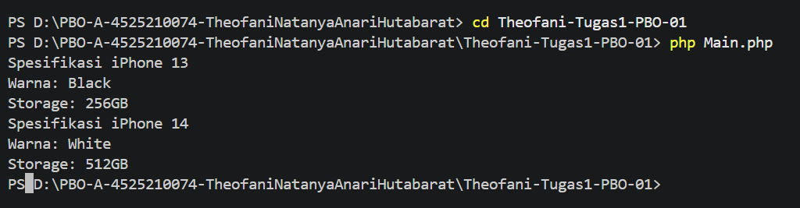
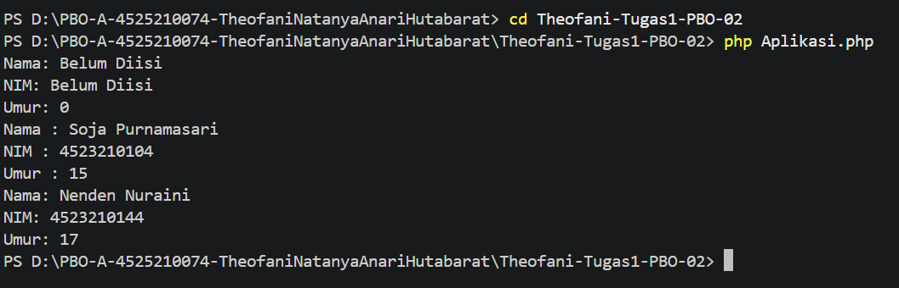
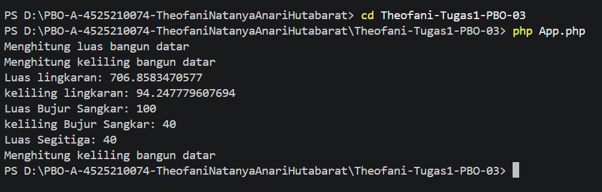
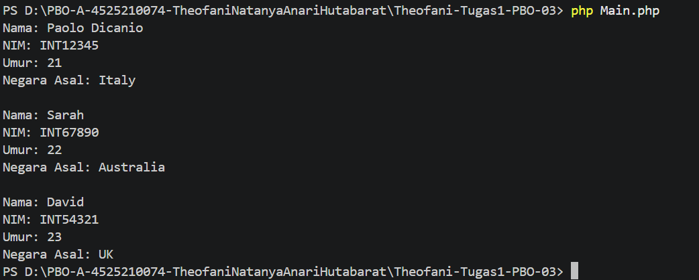
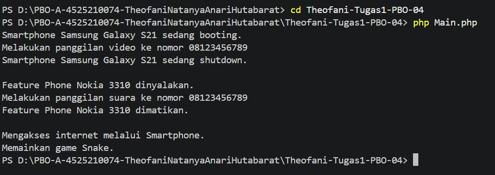
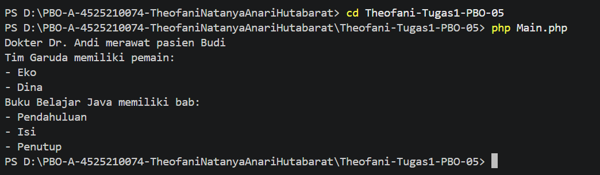
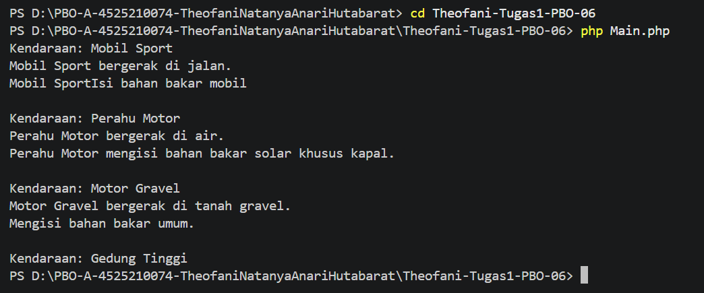

# Tugas 1 (PBO-A)

NAMA : Theofani Natanya Anari Hutabarat  
NPM  : 4525210074

## Konversi Source Code Java ke PHP (Pertemuan 01 - 06)

Repository ini berisi kumpulan hasil praktikum konversi source code dari bahasa Java ke PHP yang dikerjakan selama enam pertemuan pertama. Setiap folder berisi source code yang telah disesuaikan dengan sintaks PHP serta dilengkapi dengan hasil output dari program.

## Pertemuan 01

Pada pertemuan pertama, materi yang dipelajari berfokus pada konsep dasar pemrograman berorientasi objek di PHP, yaitu pembuatan class dan proses instansiasi objek dari class tersebut.

### Output

## Pertemuan 02:

Pada pertemuan kedua, materi membahas penggunaan constructor dengan `__construct()`. Constructor digunakan untuk melakukan inisialisasi nilai properti ketika sebuah objek pertama kali dibuat.

### Output

## Pertemuan 03:

Pertemuan ketiga membahas konsep inheritance atau pewarisan dalam pemrograman berorientasi objek. Dengan menggunakan kata kunci `extends`, sebuah *child class* dapat mewarisi properti dan method dari *parent class*.

### Output

## Pertemuan 04:

Pada pertemuan keempat, materi yang dipelajari adalah konsep polymorphism. Konsep ini memungkinkan suatu objek memiliki perilaku yang berbeda, salah satunya melalui penerapan *method overriding*.

### Output

-

## Pertemuan 05:

Pertemuan kelima membahas hubungan antar objek dalam pemrograman berorientasi objek. Materi yang dipelajari mencakup hubungan asosiasi serta hubungan agregasi dan komposisi.

### Output

## Pertemuan 06:

Pada pertemuan keenam, materi berfokus pada konsep abstraksi. Penerapan abstraksi dilakukan menggunakan `abstract class` dan `interface` dengan memanfaatkan kata kunci `implements`.

### Screenshot Hasil Output

